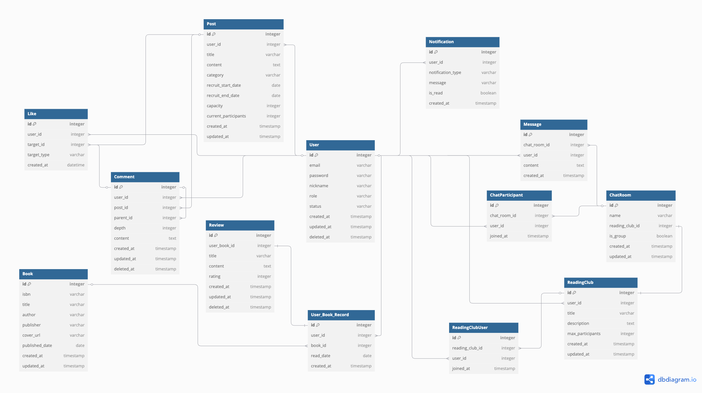

# Bookmate : 독서 커뮤니티 플랫폼

책을 읽으면서 느낀 점을 기록하고 공유하는 것은 독서를 더 깊이 있게 만들어 줍니다.<br/>
이를 위해 도서 정보 제공, 도서 리뷰, 독서 모임, 게시글 및 채팅 기능을 포함한 독서 커뮤니티 플랫폼을 제공합니다.

<br/>

## 🖌️ 문서

- [Figma](https://www.figma.com/design/zTrQn3zufIdRL5WanE1A35/%EB%8F%85%EC%84%9C%ED%94%8C%EB%9E%AB%ED%8F%BC?node-id=0-1&t=oeslKdQ9h8St817t-1) : 와이어 프레임
- [Notion](https://waiting-cathedral-0c2.notion.site/29-1-19ebd403e38f801b97e0fe4cf715741a?pvs=4) : 기획
- [Swagger]() : API 명세서

<br/>

## 🗒️ ERD



<br/>

## 🛠 기술 스택

### Back-end
<div align=center> 
    
     
     
    

    <br>
    
    
    
    
    
    <br>
</div>

<br/>

## ⚙ 아키텍쳐

<br/>

## 🗂️ 폴더 구조
```
src
└── main
    ├── java
    │   └── com.bookmate.bookmate
    │       ├── user
    │       │   ├── controller
    │       │   ├── dto
    │       │   ├── entity
    │       │   ├── exception
    │       │   ├── repository
    │       │   └── service
    │       ├── book
    │       ├── chat
    │       ├── comment
    │       ├── like
    │       ├── openAI
    │       ├── post
    │       ├── readingclub
    │       ├── review
    │       ├── subscription
    │       ├── notification
    │       └── common              # 공통 로직
    │           ├── config          # 프로젝트 설정
    │           ├── error           # 전역 예외 처리
    │           └── security
    │               ├── CustomUserDetails.java
    │               ├── CustomUserDetailsService.java
    │               ├── JwtAuthenticationFilter.java
    │               └── JwtTokenProvider.java
    ├── resources
    │   └── application.yml         # 환경 설정 파일
    └── test                        # 테스트 코드
```

<br/>

## ✔️ 주요 기능
- 유저
    - 이메일 인증을 통한 회원가입
    - JWT를 활용한 인증/인가 로직 구현 (RTR 방식 사용)
    - 로그인 후 모든 서비스 이용 가능
    - 회원 정보 조회/수정/탈퇴
- 도서 검색
    - 알라딘 API와 연동하여 쿼리 검색 및 베스트 셀러 검색 가능
- 도서 리뷰
  - 도서를 저장하고 해당 도서에 대한 리뷰 작성 가능
  - 도서마다 작성된 리뷰를 조회 가능
- 독서 모임
    - 한 유저가 한 개의 독서모임만 개설 가능
    - 독서 모임 생성/수정/삭제 (개설자만 허용)
    - 독서 모임 전체 목록 조회, 상세 조회, 특정 유저가 참여한 모임 목록 조회, 특정 독서모임의 참여/신청자 목록 조회
    - 독서 모임 모집 게시글을 통해 독서모임 참여 신청 가능
    - 독서 모임 개설자는 참여 신청 목록을 확인 후 승인/거절
    - 독서 모임 참여 승인 시 자동 그룹 채팅방 초대
    - 독서 모임 탈퇴
- 채팅
    - 상대방 프로필을 통해 상대방과 1:1 채팅 가능
    - 독서 모임에 참여한 경우 해당 모임 그룹 채팅 가능
- 알림
    - 메시지, 좋아요가 오면 유저 디바이스로 알림 도착 (FCM)
- 게시글
    - 자유 게시글, 독서 토론 게시글, 독서 모임 모집 게시글 카테고리로 나누어져 있음
    - 독서 모임 모집 게시글의 경우 모집 기간, 모집 인원 수, 현재 신청된 인원 수 확인 가능
    - 좋아요 순으로 게시글 정렬 가능
    - AI 보정 기능
- 좋아요
    - 게시글과 댓글에 좋아요 기능 추가
    - 토글 방식으로 구현
- 댓글
    - 대댓글을 사용하여 작성자와 소통 가능
- 게시글 보정
  - 작성된 게시글을 OpenAI를 통해 미리 작성된 프롬프트를 사용하여 보정 가능
<br/>

## 💻 팀원 소개

<table>
    <tr align="center">
        <td><B>Leader / Backend</B></td>
        <td><B>Backend</B></td>
    </tr>
    <tr align="center">
        <td><B>허은리</B></td>
        <td><B>상우진</B></td>
    </tr>
    <tr align="center">
        <td>
            
            <br>
            <a href="https://github.com/eunli"><I>eunli</I></a>
        </td>
        <td>
            
            <br>
            <a href="https://github.com/tkdalsrb123"><I>Woojin</I></a>
        </td>
    </tr>
</table>